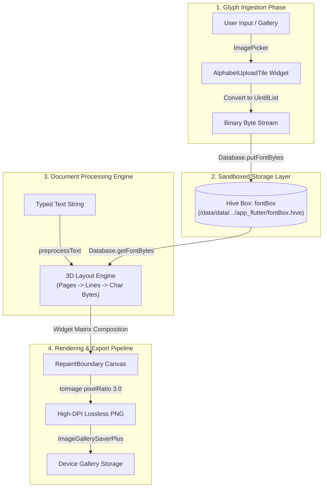

# ✍️ Inkify — On-Device Custom Handwriting Synthesis & Document Engine

[](https://flutter.dev/)
[](https://dart.dev/)
[](https://pub.dev/packages/hive)
[](https://flutter.dev/)
[](LICENSE)

> **Inkify** is an offline-first, cross-platform Flutter application that synthesizes custom user handwriting samples into high-resolution digital documents. Built with direct binary byte-stream caching and a custom 3D document layout engine, Inkify turns typed notes into realistic handwritten sheets completely on-device.

---

## ✨ Features

- ✍️ **Custom Font Glyph Engine**: Upload custom handwriting images for uppercase ($A-Z$), lowercase ($a-z$), numbers ($0-9$), and special characters ($!@\#\$\%\dots$).
- ⚡ **Zero-Latency Offline Persistence**: Powered by **Hive NoSQL** key-value storage caching raw `Uint8List` image byte arrays directly in the OS application sandbox.
- 📐 **Dynamic 3D Document Layout Engine**: Automatically computes character metrics, line limits, and page splits for standard A4 document rendering.
- 🖼️ **Super-Sampled High-DPI Export**: Leverages Flutter's `RepaintBoundary` with $3.0\times$ canvas supersampling to generate lossless PNG outputs directly to the device gallery.
- 🔒 **100% Private & Offline**: No cloud APIs, external network requests, or tracking. All user font samples remain isolated inside Android/iOS sandboxed storage.

---

## 🏗️ Architecture & Data Flow



---

## 🛠️ Tech Stack & Dependencies

| Layer | Library / Tool | Function |
| :--- | :--- | :--- |
| **Framework** | [Flutter SDK (v3.7+)](https://flutter.dev) | Cross-Platform UI & Render Engine |
| **Language** | [Dart](https://dart.dev) | Object-Oriented Client Logic |
| **Database** | [Hive NoSQL](https://pub.dev/packages/hive) | Sandboxed Binary Byte Stream Storage |
| **Asset Picker** | [image_picker](https://pub.dev/packages/image_picker) | Camera & Gallery Image Selection |
| **Gallery Exporter** | [image_gallery_saver_plus](https://pub.dev/packages/image_gallery_saver_plus) | Native Android/iOS Media Storage APIs |
| **Permissions** | [permission_handler](https://pub.dev/packages/permission_handler) | OS Hardware Access Management |
| **Typography & UI** | [google_fonts](https://pub.dev/packages/google_fonts), [marquee](https://pub.dev/packages/marquee), [flutter_animated_button](https://pub.dev/packages/flutter_animated_button) | Modern Micro-Interactions & Styling |

---

## 📂 Project Structure

```text
lib/
├── components/           # Reusable UI Components
│   ├── grid_builder.dart  # ASCII Character Matrix Builder
│   ├── letter_tile.dart   # Character Slot Picker & Storage Trigger
│   ├── my_drawer.dart     # Primary Navigation Drawer
│   ├── textfield.dart     # Dynamic Constrained Input Controller
│   └── upload_tile.dart   # Category Cards (A-Z, a-z, 0-9, Specials)
├── hive/
│   └── database.dart      # Hive Storage Controller & Uint8List Caching
├── pages/
│   ├── home_page.dart     # Main Dashboard & Input Workspace
│   ├── output_page.dart   # 3D Layout Processor, Canvas Preview & Exporter
│   ├── settings_page.dart # App Preferences & Hive Reset Controls
│   └── uploadpage.dart    # Character Category Selection Screen
└── main.dart              # App Binding & Hive Sandboxed Initialization
```

---

## 🚀 Getting Started

### Prerequisites
* [Flutter SDK](https://docs.flutter.dev/get-started/install) installed (v3.7.0 or higher)
* Android Studio / VS Code with Flutter extension
* Android Device or Emulator (API Level 21+)

### Installation & Run

1. **Clone the Repository:**
   ```bash
   git clone https://github.com/v-ai-b-ha-v/Inkify.git
   cd Inkify
   ```

2. **Install Dependencies:**
   ```bash
   flutter pub get
   ```

3. **Run the Application:**
   ```bash
   flutter run
   ```

---

## 📖 How It Works

1. **Upload Font Samples**: Open the **Upload** page and select a category (*A-Z*, *a-z*, *0-9*, or *Special Characters*). Tap any tile to upload a photo of your handwritten letter.
2. **Type / Paste Text**: Paste your assignments, notes, or paragraphs into the home page workspace.
3. **Generate & Export**: Tap **Output** to view your generated handwritten pages. Tap the **Save** icon to export high-resolution PNG pages directly to your device photo gallery.

---

## 📜 License

Distributed under the MIT License. See `LICENSE` for more information.

---

<p align="center">
  Developed with ❤️ by <a href="https://github.com/v-ai-b-ha-v">Vaibhav</a>
</p>
